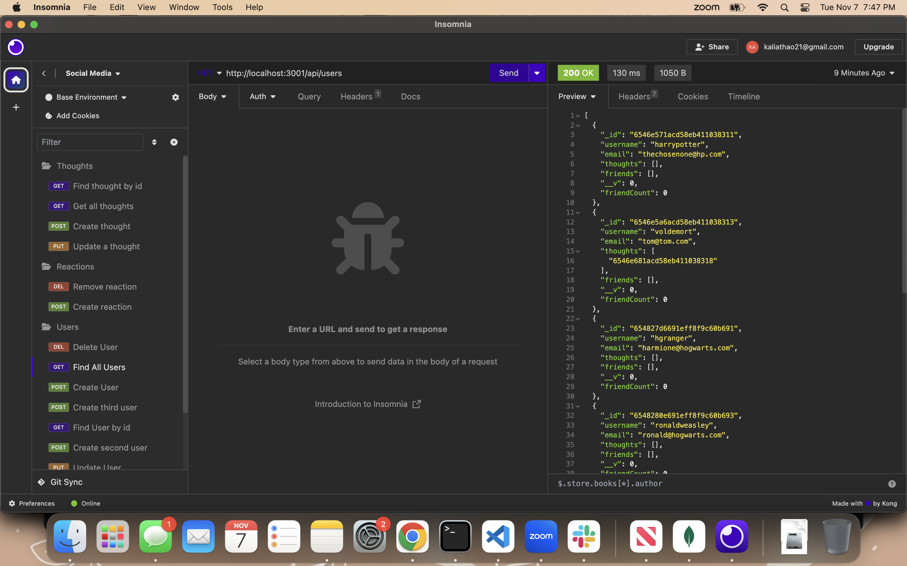

# social-media-startup

## Description

The purpose of this application is to create an API for my social media startup that uses NoSQL database to handle large amounts of unstructured data.

## Table of Contents

- [Installation](#installation)
- [Usage](#usage)
- [License](#license)

## Installation

1. On Github.com, navigate to the main page of the repository- kthao21.github.io/social-media-startup/
2. Above the list of files, click < > code.
3. Clone the repository.
4. Open the command line.
5. Change the current working directory to the location where you want the cloned directory.
6. Type “git clone”, and then paste the URL that was copied in step 3.
7. Press the “Enter” key to create your local clone.
8. Open the social media startup in your code editor.
9. Run "npm i" to install all the dependencies.
10. Run "npm start" to run the application on insomnia.

## Usage

## License

MIT License